**Note to Professor:** I could not submit the ZIP file through Moodle because the submission settings allowed only a PDF file. Therefore, I uploaded the complete project with the source code, screenshots, terminal outputs, and report files to GitHub: <https://github.com/commedeschamps/AOS_7lab.git>.

# Laboratory Work 7: Deadlocks

**Student:** Rakhman Seidigali  
**Group:** SE-2411  
**University:** Astana IT University  
**Course:** Advanced Operating Systems  
**Lab title:** Laboratory Work 7: Deadlocks - Detection, Prevention, and Avoidance

## 1. Task 1 - Theory

### 1.1 Hospital Resource System

A Resource Allocation Graph (RAG) is a directed graph used to describe the relationship between processes and resources in an operating system. In this graph, processes are usually shown as process nodes, and resources are shown as resource nodes. The direction of an edge explains whether a process is waiting for a resource or whether a resource is already assigned to a process.

There are two important edge types:

- **Request edge:** `Process -> Resource`. This means the process is waiting for that resource.
- **Assignment edge:** `Resource -> Process`. This means the resource is currently allocated to that process.

For the hospital resource system:

- Processes: PatientAdmission (PA), Billing (B), MedicalRecords (MR)
- Resources: Database (DB), 1 instance, and PrinterQueue (PQ), 1 instance
- PA holds DB and requests PQ.
- B holds PQ and requests DB.
- MR is idle.

The Resource Allocation Graph is:

```text
DB -> PA -> PQ -> B -> DB

MR is idle and has no edges.
```

The edge `DB -> PA` means the database is assigned to PatientAdmission. The edge `PA -> PQ` means PatientAdmission is waiting for the printer queue. The edge `PQ -> B` means the printer queue is assigned to Billing. The edge `B -> DB` means Billing is waiting for the database.

This graph forms a closed cycle:

```text
DB -> PA -> PQ -> B -> DB
```

Because DB and PQ each have only one instance, this cycle is not only a possible waiting cycle but a real deadlock. PA cannot continue until B releases PQ, and B cannot continue until PA releases DB. Neither process can make progress.

### 1.2 Coffman Conditions

Deadlock can occur only when all four Coffman conditions hold at the same time.

| Condition | Explanation in this system |
|---|---|
| Mutual Exclusion | DB and PQ each have one instance. Only one process can use each resource at a time. |
| Hold and Wait | PA holds DB while waiting for PQ. B holds PQ while waiting for DB. |
| No Preemption | The operating system does not forcibly take DB from PA or PQ from B. The resources must be released voluntarily. |
| Circular Wait | PA waits for a resource held by B, and B waits for a resource held by PA. |

Since all four conditions are true, deadlock exists between PatientAdmission and Billing. MedicalRecords is not involved because it is idle and has no request or assignment edges.

### 1.3 Case Where DB Has Two Instances

If DB has two instances and MR receives one DB instance, the resource model changes because DB is no longer a single-instance resource. With multiple instances of a resource, a cycle in a Resource Allocation Graph does not always guarantee deadlock. Another free instance of the resource may still allow a blocked process to continue.

In this specific scenario, the result depends on whether any DB instance is available:

- If MR holds the second DB instance and does not release it, then B cannot obtain DB. PA is still waiting for PQ, and B is still waiting for DB. In that case, PA and B can remain blocked.
- If MR releases DB, then B may obtain a DB instance, complete its work, and release PQ. After PQ is released, PA can continue. This breaks the waiting chain.

Therefore, with two DB instances, the existence of a cycle must be analyzed together with the number of available resource instances. A cycle is still a warning sign, but it is not always sufficient proof of deadlock when resources have multiple instances.

### 1.4 Worksheet

| Scenario | Deadlock? | Coffman condition analysis |
|---|---:|---|
| 1 | YES | Circular wait exists, and the other required conditions are also assumed to hold. Since all Coffman conditions are satisfied, deadlock exists. |
| 2 | NO | P2 can release R2, so the waiting chain can be broken. Circular wait is absent, so deadlock cannot exist. |
| 3 | NO | The file is shared and read-only, so mutual exclusion is violated. If a resource can be safely shared, it does not create a deadlock by itself. |
| 4 | NO | Neither process holds a resource while waiting for another one. Hold and wait is violated, so deadlock cannot occur. |

## 2. Task 2 - Deadlock Detection

### 2.1 Purpose of the Program

The purpose of `deadlock_detection.py` is to detect deadlock in Resource Allocation Graphs using cycle detection. The program builds several RAG scenarios and checks whether each graph contains a cycle. For single-instance resources, a cycle means that every process in the cycle is waiting for a resource held by another process in the same cycle, so deadlock exists.

### 2.2 Program Design

The program defines a `ResourceAllocationGraph` class. The graph stores all nodes in one node set and stores directed edges in an adjacency list. Conceptually, the nodes can be divided into process nodes such as `P1`, `P2`, and `P3`, and resource nodes such as `R1`, `R2`, and `R3`. In this implementation, both types are stored together in `_nodes`, and the node names show whether the node is a process or a resource.

The important data structures are:

- **Node set:** `_nodes` stores all process and resource names.
- **Adjacency list:** `adjacency[source]` stores every destination node that can be reached from `source`.
- **Color dictionary:** during DFS, each node is marked `white`, `gray`, or `black`.
- **DFS stack:** stores the current recursion path so the cycle path can be reconstructed.
- **Stack index dictionary:** maps a node to its position in the DFS stack.

The code uses one method, `add_edge(source, destination)`, for both kinds of RAG edges:

- A request edge is represented as `Process -> Resource`.
- An assignment edge is represented as `Resource -> Process`.

### 2.3 DFS Cycle Detection

Depth-first search is used to detect cycles. Each node starts as `white`, meaning it has not been visited. When DFS begins exploring a node, the node becomes `gray`, meaning it is currently in the recursion stack. When all outgoing edges from a node have been processed, the node becomes `black`.

If DFS finds an edge from the current node to a `gray` node, that edge points back to a node already in the current recursion path. This is called a back edge, and it proves that a cycle exists. The program then reconstructs the cycle path using the DFS stack.

This method is enough for the scenarios in this task because all resources are treated as single-instance resources. In a single-instance RAG, a cycle is both necessary and sufficient for deadlock.

### 2.4 Source Code

File: `code/deadlock_detection.py`

```python
"""Laboratory Work 7 - Task 2: Deadlock detection using a RAG.

The program models a Resource Allocation Graph (RAG) as a directed graph:
- Resource -> Process means the resource is allocated to the process.
- Process -> Resource means the process is requesting the resource.

For single-instance resources, a cycle in the RAG indicates deadlock.
"""

from collections import defaultdict


class ResourceAllocationGraph:
    """Directed graph with DFS-based cycle detection."""

    def __init__(self):
        self.adjacency = defaultdict(list)
        self._nodes = set()

    def add_edge(self, source, destination):
        """Add a directed edge to the graph."""
        self.adjacency[source].append(destination)
        self._nodes.add(source)
        self._nodes.add(destination)

    @property
    def nodes(self):
        return sorted(self._nodes)

    @property
    def edges(self):
        graph_edges = []
        for source in sorted(self.adjacency):
            for destination in sorted(self.adjacency[source]):
                graph_edges.append((source, destination))
        return graph_edges

    def detect_cycle(self):
        """Return (cycle_exists, cycle_path)."""
        color = {node: "white" for node in self._nodes}
        stack = []
        stack_index = {}

        def dfs(node):
            color[node] = "gray"
            stack_index[node] = len(stack)
            stack.append(node)

            for neighbor in sorted(self.adjacency[node]):
                if color[neighbor] == "white":
                    cycle = dfs(neighbor)
                    if cycle:
                        return cycle
                elif color[neighbor] == "gray":
                    start = stack_index[neighbor]
                    return stack[start:] + [neighbor]

            stack.pop()
            stack_index.pop(node)
            color[node] = "black"
            return None

        for node in self.nodes:
            if color[node] == "white":
                cycle = dfs(node)
                if cycle:
                    return True, cycle

        return False, []


def build_graph(edges):
    graph = ResourceAllocationGraph()
    for source, destination in edges:
        graph.add_edge(source, destination)
    return graph


def print_scenario(title, edges):
    graph = build_graph(edges)
    deadlock_detected, cycle_path = graph.detect_cycle()

    print("=" * 72)
    print(title)
    print("-" * 72)
    print("Graph nodes:")
    print("  " + ", ".join(graph.nodes))
    print("Graph edges:")
    for source, destination in graph.edges:
        print(f"  {source} -> {destination}")
    print("Deadlock detected:", "YES" if deadlock_detected else "NO")

    if deadlock_detected:
        print("Cycle path:")
        print("  " + " -> ".join(cycle_path))
    else:
        print("Cycle path:")
        print("  None")
    print()


def main():
    scenarios = [
        (
            "Scenario 1: Classic three-process deadlock",
            [
                ("R1", "P1"),
                ("R2", "P2"),
                ("R3", "P3"),
                ("P1", "R2"),
                ("P2", "R3"),
                ("P3", "R1"),
            ],
        ),
        (
            "Scenario 2: No deadlock",
            [
                ("R1", "P1"),
                ("P2", "R1"),
            ],
        ),
        (
            "Scenario 3: Chain dependency without cycle",
            [
                ("R1", "P1"),
                ("R2", "P2"),
                ("P2", "R1"),
                ("P3", "R2"),
            ],
        ),
        (
            "Scenario 4: Only two processes are deadlocked",
            [
                ("R1", "P1"),
                ("R2", "P2"),
                ("R3", "P3"),
                ("P1", "R2"),
                ("P2", "R1"),
                ("P4", "R3"),
            ],
        ),
    ]

    for title, edges in scenarios:
        print_scenario(title, edges)


if __name__ == "__main__":
    main()
```

### 2.5 Screenshot

The program was run with:

```bash
python code/deadlock_detection.py
```

Saved text transcript: `terminal_outputs/deadlock_detection_output.txt`

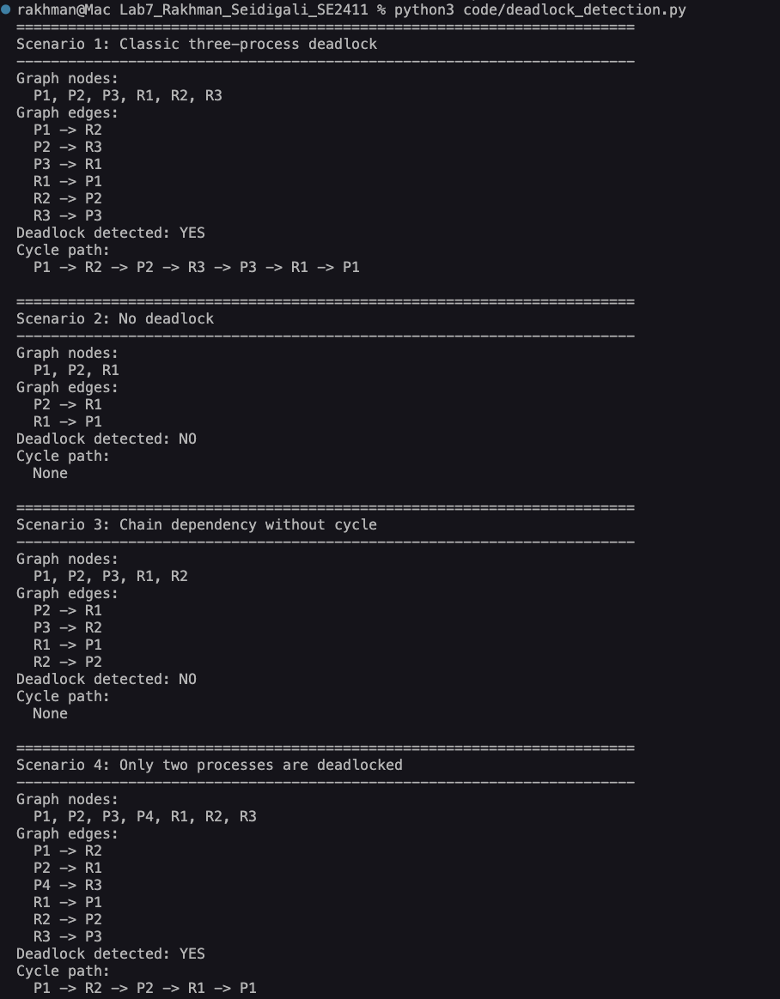

**Figure 2.1:** Terminal output of `deadlock_detection.py`, including all four Resource Allocation Graph scenarios.

### 2.6 Scenario Analysis

**Scenario 1 - Classic three-process deadlock**

Edges:

```text
R1 -> P1
R2 -> P2
R3 -> P3
P1 -> R2
P2 -> R3
P3 -> R1
```

The detected cycle is:

```text
P1 -> R2 -> P2 -> R3 -> P3 -> R1 -> P1
```

This is a deadlock because each process holds one resource and waits for the next resource in the cycle. P1 holds R1 and waits for R2. P2 holds R2 and waits for R3. P3 holds R3 and waits for R1. Mutual exclusion holds because the resources are single-instance. Hold and wait holds because every process keeps one resource while requesting another. No preemption holds because resources are not forcibly removed. Circular wait holds because the graph returns to P1.

**Scenario 2 - No deadlock**

Edges:

```text
R1 -> P1
P2 -> R1
```

Waiting exists because P2 is waiting for R1. However, P1 is not waiting for another resource. The graph does not return to P2, so there is no circular wait. Since circular wait is missing, the system is not deadlocked. P2 may be blocked temporarily, but P1 can eventually release R1.

**Scenario 3 - Chain dependency without cycle**

Edges:

```text
R1 -> P1
R2 -> P2
P2 -> R1
P3 -> R2
```

The dependency chain is:

```text
P3 -> R2 -> P2 -> R1 -> P1
```

This is a chain, not a cycle. P3 waits for R2, and P2 waits for R1, but P1 is not waiting for another resource. Therefore, the chain can eventually end when P1 releases R1. Deadlock is not detected because circular wait is absent.

**Scenario 4 - Only two processes are deadlocked**

Edges:

```text
R1 -> P1
R2 -> P2
R3 -> P3
P1 -> R2
P2 -> R1
P4 -> R3
```

The detected cycle is:

```text
P1 -> R2 -> P2 -> R1 -> P1
```

Only P1 and P2 are inside the cycle. P1 holds R1 and waits for R2, while P2 holds R2 and waits for R1. This satisfies all Coffman conditions for P1 and P2.

P3 is not deadlocked because it holds R3 but does not request another resource. P4 is waiting for R3, but P4 does not hold a resource that P3 needs, and P4 is not part of the cycle. Therefore, P4 may be blocked, but it is not deadlocked in this graph.

## 3. Task 3 - Banker's Algorithm

### 3.1 Purpose of Banker's Algorithm

Banker's Algorithm is a deadlock avoidance algorithm. It does not wait until deadlock appears and then detect it. Instead, it checks whether granting a resource request would leave the system in a safe state. A safe state is a state where there is at least one sequence of process completion that allows every process to finish.

The main idea is conservative resource allocation. A request is granted only if the system can still find a safe sequence after the simulated allocation.

### 3.2 Matrices and Vectors

The algorithm uses the following data:

| Name | Meaning |
|---|---|
| Available | Number of available instances for each resource type. |
| Max | Maximum demand each process may request. |
| Allocation | Resources currently allocated to each process. |
| Need | Remaining resources each process may still request. |

The Need matrix is calculated as:

```text
Need = Max - Allocation
```

The safety algorithm also uses:

- **Work:** a temporary vector initialized as Available. It represents resources that could be available while simulating process completion.
- **Finish:** a Boolean array showing whether each process can finish in the simulated sequence.

If a process has `Need <= Work`, then the process can finish. When it finishes, it releases its Allocation back into Work. The algorithm repeats this until either all processes finish or no further progress is possible.

### 3.3 Source Code

File: `code/bankers_algorithm.py`

```python
"""Laboratory Work 7 - Task 3: Banker's Algorithm.

Process labels in this script are one-based: P1, P2, P3, ...
Internally, Python list indices remain zero-based.
"""


class BankersAlgorithm:
    """Implementation of the safety and resource-request algorithms."""

    def __init__(self, available, max_demand, allocation, resource_names=None):
        self.available = [int(value) for value in available]
        self.max_demand = [list(row) for row in max_demand]
        self.allocation = [list(row) for row in allocation]
        self.process_count = len(allocation)
        self.resource_count = len(available)
        self.resource_names = resource_names or [
            f"R{index + 1}" for index in range(self.resource_count)
        ]
        self._validate_dimensions()
        self.need = self.calculate_need()

    def _validate_dimensions(self):
        if len(self.max_demand) != self.process_count:
            raise ValueError("max_demand and allocation must have the same row count.")

        for matrix_name, matrix in (
            ("max_demand", self.max_demand),
            ("allocation", self.allocation),
        ):
            for row in matrix:
                if len(row) != self.resource_count:
                    raise ValueError(
                        f"{matrix_name} rows must match the number of resources."
                    )

    def calculate_need(self):
        """Need = Max - Allocation."""
        return [
            [
                self.max_demand[process][resource]
                - self.allocation[process][resource]
                for resource in range(self.resource_count)
            ]
            for process in range(self.process_count)
        ]

    def process_label(self, process_index):
        return f"P{process_index + 1}"

    @staticmethod
    def _vector_leq(left, right):
        return all(left_value <= right_value for left_value, right_value in zip(left, right))

    @staticmethod
    def _vector_add(left, right):
        return [left_value + right_value for left_value, right_value in zip(left, right)]

    @staticmethod
    def _vector_subtract(left, right):
        return [left_value - right_value for left_value, right_value in zip(left, right)]

    def display_state(self):
        """Print Available, Max, Allocation, and Need."""
        headers = ["Process", "Allocation", "Max", "Need"]
        print(f"{headers[0]:<10}{headers[1]:<18}{headers[2]:<18}{headers[3]:<18}")
        print("-" * 64)
        for process in range(self.process_count):
            print(
                f"{self.process_label(process):<10}"
                f"{str(self.allocation[process]):<18}"
                f"{str(self.max_demand[process]):<18}"
                f"{str(self.need[process]):<18}"
            )
        print(f"Available: {self.available}")
        print()

    def is_safe(self, verbose=True):
        """Run the safety algorithm.

        Returns:
            (is_safe_state, safe_sequence, unfinished_processes)
        """
        work = list(self.available)
        finish = [False] * self.process_count
        safe_sequence = []

        if verbose:
            print("Running safety algorithm...")
            print(f"Initial Work = Available = {work}")

        progress = True
        while progress:
            progress = False
            for process in range(self.process_count):
                if not finish[process] and self._vector_leq(self.need[process], work):
                    if verbose:
                        print(
                            f"  {self.process_label(process)} can finish: "
                            f"Need {self.need[process]} <= Work {work}"
                        )
                    work = self._vector_add(work, self.allocation[process])
                    finish[process] = True
                    safe_sequence.append(self.process_label(process))
                    progress = True
                    if verbose:
                        print(
                            f"  Work after {self.process_label(process)} releases "
                            f"resources: {work}"
                        )

        unfinished = [
            self.process_label(process)
            for process in range(self.process_count)
            if not finish[process]
        ]
        is_safe_state = all(finish)

        if verbose:
            print("Safe state:", "YES" if is_safe_state else "NO")
            if is_safe_state:
                print("Safe sequence:", " -> ".join(safe_sequence))
            else:
                print("Processes that cannot proceed:", ", ".join(unfinished))
            print()

        return is_safe_state, safe_sequence, unfinished

    def request_resources(self, process_id, request):
        """Try to grant a request using the Banker's Algorithm.

        Args:
            process_id: one-based process id, for example P1 is process_id=1.
            request: list of requested resource instances.
        """
        process_index = process_id - 1
        if process_index < 0 or process_index >= self.process_count:
            raise ValueError("process_id must be between 1 and the process count.")
        if len(request) != self.resource_count:
            raise ValueError("request length must match the number of resources.")

        label = self.process_label(process_index)
        print(f"{label} requests {request}")
        print(f"Current Need[{label}] = {self.need[process_index]}")
        print(f"Current Available = {self.available}")

        if not self._vector_leq(request, self.need[process_index]):
            print("Decision: DENIED")
            print("Reason: request exceeds the process need.")
            print()
            return False

        if not self._vector_leq(request, self.available):
            print("Decision: DENIED")
            print("Reason: request exceeds currently available resources.")
            print()
            return False

        original_available = list(self.available)
        original_allocation = [list(row) for row in self.allocation]
        original_need = [list(row) for row in self.need]

        self.available = self._vector_subtract(self.available, request)
        self.allocation[process_index] = self._vector_add(
            self.allocation[process_index], request
        )
        self.need[process_index] = self._vector_subtract(
            self.need[process_index], request
        )

        safe, sequence, unfinished = self.is_safe(verbose=False)
        if safe:
            print("Decision: GRANTED")
            print("Reason: resulting state is safe.")
            print("Safe sequence after grant:", " -> ".join(sequence))
            print()
            return True

        self.available = original_available
        self.allocation = original_allocation
        self.need = original_need
        print("Decision: DENIED")
        print("Reason: resulting state would be unsafe.")
        print("Processes blocked in simulated state:", ", ".join(unfinished))
        print()
        return False


def run_classic_example():
    print("=" * 72)
    print("Classic 5-process, 3-resource example")
    print("=" * 72)

    available = [3, 3, 2]
    max_demand = [
        [7, 5, 3],
        [3, 2, 2],
        [9, 0, 2],
        [2, 2, 2],
        [4, 3, 3],
    ]
    allocation = [
        [0, 1, 0],
        [2, 0, 0],
        [3, 0, 2],
        [2, 1, 1],
        [0, 0, 2],
    ]

    banker = BankersAlgorithm(available, max_demand, allocation, ["A", "B", "C"])

    print("Test 1: Check current state safety")
    banker.display_state()
    banker.is_safe()

    print("Test 2: P1 requests [1, 0, 2]")
    banker.request_resources(1, [1, 0, 2])

    print("Test 3: P4 requests [3, 3, 0]")
    banker.request_resources(4, [3, 3, 0])

    print("Test 4: Modified unsafe state")
    unsafe_banker = BankersAlgorithm(
        available=[0, 0, 0],
        max_demand=max_demand,
        allocation=allocation,
        resource_names=["A", "B", "C"],
    )
    unsafe_banker.display_state()
    unsafe_banker.is_safe()


def run_custom_example():
    print("=" * 72)
    print("Custom 4-process, 2-resource example")
    print("=" * 72)

    custom_available = [2, 1]
    custom_max = [
        [3, 2],
        [2, 2],
        [4, 3],
        [2, 1],
    ]
    custom_allocation = [
        [1, 0],
        [1, 1],
        [2, 1],
        [1, 0],
    ]

    banker = BankersAlgorithm(
        available=custom_available,
        max_demand=custom_max,
        allocation=custom_allocation,
        resource_names=["X", "Y"],
    )
    banker.display_state()
    banker.is_safe()


def main():
    run_classic_example()
    run_custom_example()


if __name__ == "__main__":
    main()
```

### 3.4 Screenshot

The program was run with:

```bash
python code/bankers_algorithm.py
```

Saved text transcript: `terminal_outputs/bankers_algorithm_output.txt`

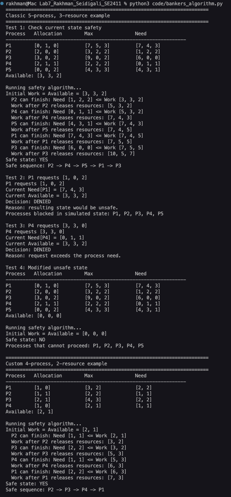

**Figure 3.1:** Terminal output of `bankers_algorithm.py`, including the classic example, request tests, unsafe state, and custom scenario.

### 3.5 Classic Example Data

Initial Available:

```text
[3, 3, 2]
```

Allocation matrix:

| Process | Allocation |
|---|---|
| P1 | [0, 1, 0] |
| P2 | [2, 0, 0] |
| P3 | [3, 0, 2] |
| P4 | [2, 1, 1] |
| P5 | [0, 0, 2] |

Max matrix:

| Process | Max |
|---|---|
| P1 | [7, 5, 3] |
| P2 | [3, 2, 2] |
| P3 | [9, 0, 2] |
| P4 | [2, 2, 2] |
| P5 | [4, 3, 3] |

Need matrix:

| Process | Need |
|---|---|
| P1 | [7, 4, 3] |
| P2 | [1, 2, 2] |
| P3 | [6, 0, 0] |
| P4 | [0, 1, 1] |
| P5 | [4, 3, 1] |

### 3.6 Safe Sequence Explanation

The initial state is safe. The safe sequence printed by the program is:

```text
P2 -> P4 -> P5 -> P1 -> P3
```

Step-by-step simulation:

| Step | Work before | Process | Reason | Work after release |
|---:|---|---|---|---|
| 1 | [3, 3, 2] | P2 | Need [1, 2, 2] <= Work [3, 3, 2] | [5, 3, 2] |
| 2 | [5, 3, 2] | P4 | Need [0, 1, 1] <= Work [5, 3, 2] | [7, 4, 3] |
| 3 | [7, 4, 3] | P5 | Need [4, 3, 1] <= Work [7, 4, 3] | [7, 4, 5] |
| 4 | [7, 4, 5] | P1 | Need [7, 4, 3] <= Work [7, 4, 5] | [7, 5, 5] |
| 5 | [7, 5, 5] | P3 | Need [6, 0, 0] <= Work [7, 5, 5] | [10, 5, 7] |

At each step, when a process finishes, it releases its allocated resources. This increases Work and makes it possible for more processes to finish. Since all processes can finish in this sequence, the state is safe.

### 3.7 Request Tests

The algorithm checks safety before granting a request because a request can appear valid locally but still make the whole system unsafe. The request must pass three checks:

1. `Request <= Need`
2. `Request <= Available`
3. The simulated state after granting the request must still be safe.

**Test 2 - P1 requests [1, 0, 2]**

P1's original Need is `[7, 4, 3]`, so `[1, 0, 2] <= [7, 4, 3]`. The Available vector is `[3, 3, 2]`, so `[1, 0, 2] <= [3, 3, 2]`. The request passes the first two checks.

However, the algorithm then simulates granting the request. After the simulated allocation, Available becomes `[2, 3, 0]`. With no instances of the third resource available, no process can satisfy its Need in that simulated state. The program therefore denies the request because the resulting state would be unsafe.

**Test 3 - P4 requests [3, 3, 0]**

P4's Need is `[0, 1, 1]`. The request `[3, 3, 0]` exceeds P4's remaining maximum claim. A process is not allowed to request more than its declared Need, so the request is denied immediately without running the safety simulation.

### 3.8 Unsafe State Explanation

In the modified unsafe state, Available is changed to:

```text
[0, 0, 0]
```

The Need matrix remains:

| Process | Need | Why it cannot proceed with Work [0, 0, 0] |
|---|---|---|
| P1 | [7, 4, 3] | Needs all three resources. |
| P2 | [1, 2, 2] | Needs all three resources. |
| P3 | [6, 0, 0] | Needs resource A. |
| P4 | [0, 1, 1] | Needs resources B and C. |
| P5 | [4, 3, 1] | Needs all three resources. |

No process has `Need <= Work`, so no process can finish and release resources. The program correctly reports that P1, P2, P3, P4, and P5 cannot proceed. This is an unsafe state.

### 3.9 Custom Scenario Manual Need Matrix

Custom Available:

```text
[2, 1]
```

Custom Max:

| Process | Max |
|---|---|
| P1 | [3, 2] |
| P2 | [2, 2] |
| P3 | [4, 3] |
| P4 | [2, 1] |

Custom Allocation:

| Process | Allocation |
|---|---|
| P1 | [1, 0] |
| P2 | [1, 1] |
| P3 | [2, 1] |
| P4 | [1, 0] |

Manual Need calculation:

```text
Need = Max - Allocation
```

| Process | Calculation | Need |
|---|---|---|
| P1 | [3, 2] - [1, 0] | [2, 2] |
| P2 | [2, 2] - [1, 1] | [1, 1] |
| P3 | [4, 3] - [2, 1] | [2, 2] |
| P4 | [2, 1] - [1, 0] | [1, 1] |

The program verifies the same Need matrix and finds a safe sequence:

```text
P2 -> P3 -> P4 -> P1
```

This confirms that the custom state is safe.

## 4. Task 4 - Python Threads

### 4.1 Purpose

This task demonstrates how deadlock can appear in a real program when multiple threads use locks. In Python, a `threading.Lock` is a synchronization object that allows only one thread to enter a protected critical section at a time. A lock behaves like an exclusive resource. If two threads acquire locks in different orders, they can create a circular wait and deadlock.

### 4.2 Source Code: Real Deadlock

File: `code/thread_deadlock.py`

```python
"""Laboratory Work 7 - Task 4A: Real thread deadlock simulation."""

import threading
import time


lock_A = threading.Lock()
lock_B = threading.Lock()


def thread_one():
    print("Thread 1: attempting to acquire lock A")
    lock_A.acquire()
    print("Thread 1: acquired lock A")

    # This pause makes the deadlock easier to reproduce: it gives Thread 2
    # time to acquire lock B before Thread 1 requests it.
    time.sleep(0.1)

    print("Thread 1: waiting for lock B")
    lock_B.acquire()
    print("Thread 1: acquired lock B")


def thread_two():
    print("Thread 2: attempting to acquire lock B")
    lock_B.acquire()
    print("Thread 2: acquired lock B")

    # This pause creates the opposite half of the circular wait.
    time.sleep(0.1)

    print("Thread 2: waiting for lock A")
    lock_A.acquire()
    print("Thread 2: acquired lock A")


def main():
    print("Starting real deadlock simulation...")
    t1 = threading.Thread(target=thread_one, name="Thread-1", daemon=True)
    t2 = threading.Thread(target=thread_two, name="Thread-2", daemon=True)

    t1.start()
    t2.start()

    t1.join(timeout=3)
    t2.join(timeout=3)

    if t1.is_alive() and t2.is_alive():
        print("Deadlock detected: both threads are still alive after timeout.")
        print("Thread 1 holds lock A and waits for lock B.")
        print("Thread 2 holds lock B and waits for lock A.")
    else:
        print("No deadlock detected: at least one thread completed.")


if __name__ == "__main__":
    main()
```

### 4.3 Source Code: Deadlock Prevention

File: `code/deadlock_prevention.py`

```python
"""Laboratory Work 7 - Task 4B: Deadlock prevention by lock ordering."""

import threading
import time


LOCKS = {
    "A": (1, threading.Lock()),
    "B": (2, threading.Lock()),
}


def acquire_locks_in_global_order(thread_name, requested_lock_names):
    """Acquire all requested locks in the same global order."""
    ordered_locks = sorted(requested_lock_names, key=lambda name: LOCKS[name][0])
    acquired = []

    print(
        f"{thread_name}: requested {requested_lock_names}, "
        f"acquiring in global order {ordered_locks}"
    )

    try:
        for lock_name in ordered_locks:
            print(f"{thread_name}: attempting to acquire lock {lock_name}")
            LOCKS[lock_name][1].acquire()
            acquired.append(lock_name)
            print(f"{thread_name}: acquired lock {lock_name}")
            time.sleep(0.1)

        print(f"{thread_name}: completed critical section")
    finally:
        for lock_name in reversed(acquired):
            LOCKS[lock_name][1].release()
            print(f"{thread_name}: released lock {lock_name}")


def main():
    print("Starting deadlock prevention demo with global lock ordering...")
    t1 = threading.Thread(
        target=acquire_locks_in_global_order,
        args=("Thread 1", ["A", "B"]),
    )
    t2 = threading.Thread(
        target=acquire_locks_in_global_order,
        args=("Thread 2", ["B", "A"]),
    )

    t1.start()
    t2.start()
    t1.join()
    t2.join()

    print("Both threads completed successfully.")
    print("Circular wait is removed because every thread acquires A before B.")


if __name__ == "__main__":
    main()
```

### 4.4 Source Code: Timeout-Based Recovery

File: `code/deadlock_recovery.py`

```python
"""Laboratory Work 7 - Task 4C: Detection and recovery with timeouts."""

import random
import threading
import time


TIMEOUT = 0.4
MAX_ATTEMPTS = 8

lock_A = threading.Lock()
lock_B = threading.Lock()

LOCKS = {
    "A": lock_A,
    "B": lock_B,
}


def backoff_delay(rng):
    return rng.uniform(0.05, 0.25)


def worker(thread_name, first_lock_name, second_lock_name, result, seed):
    rng = random.Random(seed)

    for attempt in range(1, MAX_ATTEMPTS + 1):
        acquired_first = False
        acquired_second = False

        print(
            f"{thread_name}: attempt {attempt}, order "
            f"{first_lock_name} -> {second_lock_name}"
        )

        try:
            acquired_first = LOCKS[first_lock_name].acquire(timeout=TIMEOUT)
            if not acquired_first:
                delay = backoff_delay(rng)
                print(
                    f"{thread_name}: timeout on lock {first_lock_name}; "
                    f"backing off for {delay:.2f}s"
                )
                time.sleep(delay)
                continue

            print(f"{thread_name}: acquired lock {first_lock_name}")
            time.sleep(0.1)

            acquired_second = LOCKS[second_lock_name].acquire(timeout=TIMEOUT)
            if not acquired_second:
                delay = backoff_delay(rng)
                print(
                    f"{thread_name}: timeout on lock {second_lock_name}; "
                    f"releasing {first_lock_name}"
                )
                LOCKS[first_lock_name].release()
                acquired_first = False
                print(f"{thread_name}: released lock {first_lock_name}")
                print(f"{thread_name}: backing off for {delay:.2f}s")
                time.sleep(delay)
                continue

            print(f"{thread_name}: acquired lock {second_lock_name}")
            print(f"{thread_name}: completed critical section")
            result[thread_name] = "completed"
            return
        finally:
            if acquired_second:
                LOCKS[second_lock_name].release()
                print(f"{thread_name}: released lock {second_lock_name}")
            if acquired_first:
                LOCKS[first_lock_name].release()
                print(f"{thread_name}: released lock {first_lock_name}")

    result[thread_name] = "failed after retries"
    print(f"{thread_name}: failed after {MAX_ATTEMPTS} attempts")


def main():
    print("Starting timeout-based deadlock detection and recovery demo...")
    result = {}

    t1 = threading.Thread(
        target=worker,
        args=("Thread 1", "A", "B", result, 101),
    )
    t2 = threading.Thread(
        target=worker,
        args=("Thread 2", "B", "A", result, 202),
    )

    t1.start()
    t2.start()
    t1.join()
    t2.join()

    print("Final result:")
    for thread_name in sorted(result):
        print(f"  {thread_name}: {result[thread_name]}")


if __name__ == "__main__":
    main()
```

### 4.5 Screenshots

The programs were run with:

```bash
python code/thread_deadlock.py
python code/deadlock_prevention.py
python code/deadlock_recovery.py
```

Saved text transcripts:

- `terminal_outputs/thread_deadlock_output.txt`
- `terminal_outputs/deadlock_prevention_output.txt`
- `terminal_outputs/deadlock_recovery_output.txt`

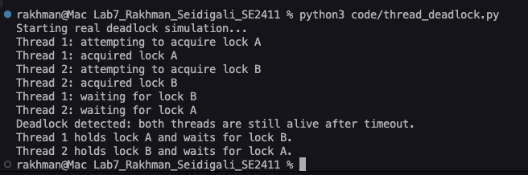

**Figure 4.1:** Real thread deadlock simulation using opposite lock acquisition order.

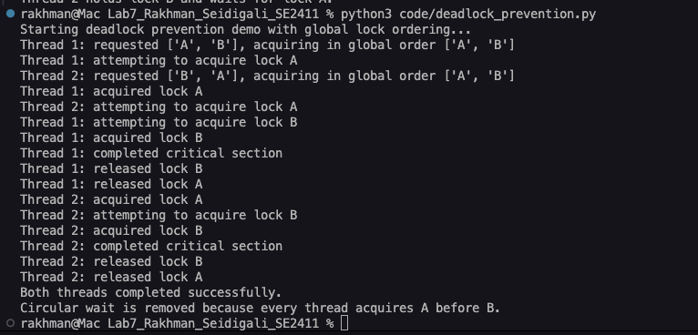

**Figure 4.2:** Deadlock prevention using a global lock ordering rule.

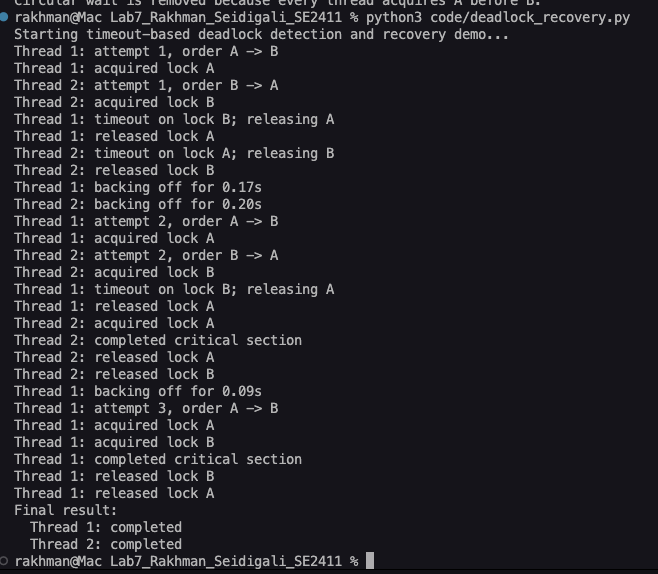

**Figure 4.3:** Timeout-based deadlock recovery run 1.

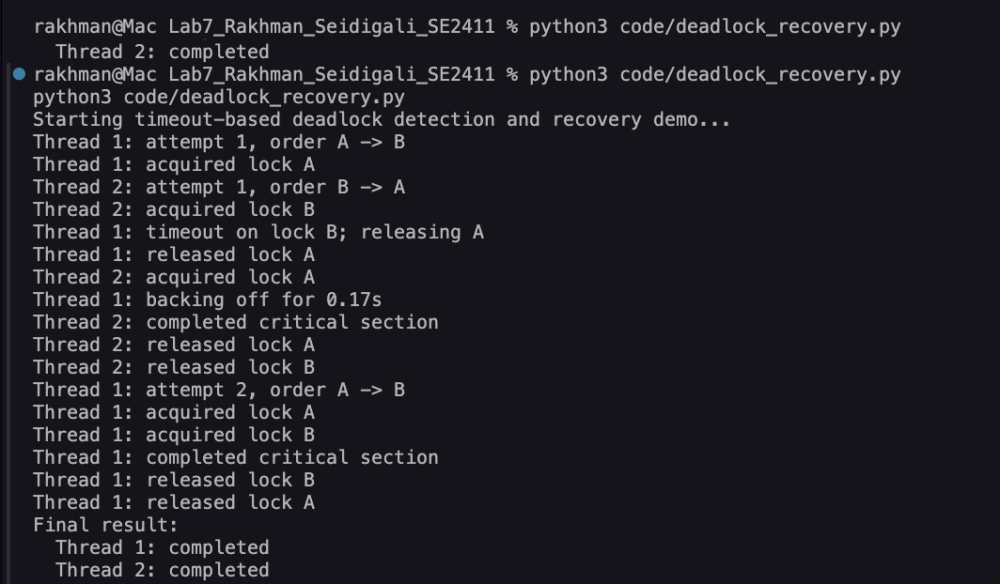

**Figure 4.4:** Timeout-based deadlock recovery run 2.

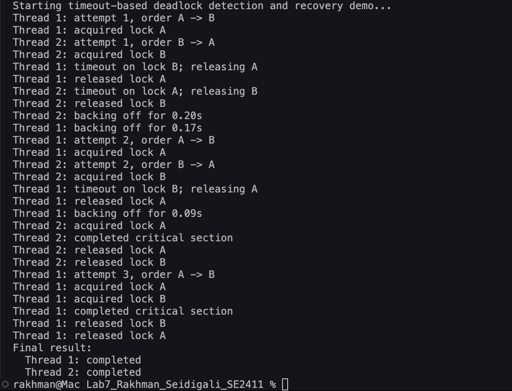

**Figure 4.5:** Timeout-based deadlock recovery run 3.

### 4.6 Part A - Real Thread Deadlock

The deadlock occurs because the two threads acquire the same locks in opposite orders.

Execution order:

1. Thread 1 acquires Lock A.
2. Thread 2 acquires Lock B.
3. Thread 1 waits for Lock B.
4. Thread 2 waits for Lock A.

At that point, neither thread can continue. Thread 1 cannot release Lock A because it is blocked waiting for Lock B. Thread 2 cannot release Lock B because it is blocked waiting for Lock A.

The Coffman conditions are satisfied:

| Condition | Thread example |
|---|---|
| Mutual Exclusion | Each lock can be held by only one thread at a time. |
| Hold and Wait | Thread 1 holds A while waiting for B. Thread 2 holds B while waiting for A. |
| No Preemption | Python does not forcibly take a lock away from a thread. |
| Circular Wait | Thread 1 waits for B held by Thread 2, and Thread 2 waits for A held by Thread 1. |

The `time.sleep(0.1)` calls make the deadlock easier to reproduce. The pause gives both threads time to acquire their first lock before attempting to acquire the second lock.

### 4.7 Part B - Prevention by Lock Ordering

Lock ordering prevents deadlock by forcing every thread to acquire locks in the same global order. In this program, Lock A has order 1 and Lock B has order 2. Even if Thread 2 requests `["B", "A"]`, the program sorts the locks and acquires `["A", "B"]`.

This removes circular wait. A thread may wait for Lock A, but no thread can hold Lock B while waiting for Lock A because Lock A must always be acquired first.

Comparison of Part A and Part B:

| Aspect | Part A: Deadlock | Part B: Prevention |
|---|---|---|
| Thread 1 order | A then B | A then B |
| Thread 2 order | B then A | A then B after sorting |
| Circular wait | Present | Removed |
| Result | Threads remain blocked | Both threads complete |
| Main idea | Demonstrates deadlock | Prevents deadlock before it occurs |

### 4.8 Part C - Timeout-Based Recovery

Timeout-based recovery does not eliminate the possibility of circular wait before it begins. Instead, each lock acquisition uses a timeout. If a thread cannot acquire the next lock within the timeout, it releases any lock it already holds, waits for a short randomized backoff period, and tries again.

The recovery steps are:

1. A thread acquires its first lock.
2. It attempts to acquire the second lock with a timeout.
3. If the second lock is not acquired, the thread releases the first lock.
4. It waits briefly using random backoff.
5. It retries until it completes or reaches the maximum number of attempts.

Random backoff helps reduce repeated collisions. Without backoff, both threads might repeatedly retry at the same time and conflict again. Runs may vary because thread scheduling and timing are not deterministic.

Comparison of lock ordering and timeout recovery:

| Strategy | Coffman condition affected | Advantages | Disadvantages | Predictability | Real OS suitability |
|---|---|---|---|---|---|
| Lock ordering | Removes circular wait | Simple, deterministic, prevents deadlock before it happens | Requires all code to follow the same ordering rule | High | Suitable when resources and acquisition order are known |
| Timeout recovery | Temporarily breaks hold and wait by releasing held locks after timeout | Flexible when strict ordering is difficult | Depends on timeout values, scheduling, and retries | Medium to low | Useful in complex systems where rollback and retry are acceptable |

Lock ordering is usually more predictable for prevention, while timeout recovery is useful when strict ordering is hard to enforce.

## 5. Task 5 - Windows OS Observation

The screenshots in this section are real observations from Windows tools. No synthetic Task Manager, Resource Monitor, or Performance Monitor data is used.

### 5.1 Task Manager Observation

The Task Manager Details view was used to observe processes and the Threads column. A thread count shows how many threads belong to a process. A process can have many threads because modern applications often separate work into UI threads, background worker threads, I/O threads, timers, and service threads.

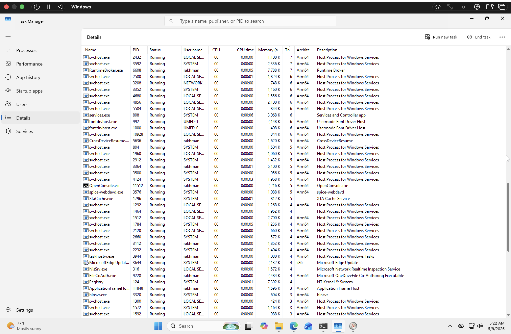

**Figure 5.1:** Task Manager Details view showing process IDs, CPU usage, and the Threads column.

Top 3 processes recorded from the screenshot:

| Process name | PID | Thread count | CPU usage | Visible status |
|---|---:|---:|---:|---|
| svchost.exe | 2432 | 7 | 0% | Running |
| svchost.exe | 3592 | 7 | 0% | Running |
| RuntimeBroker.exe | 6608 | 7 | 0% | Running |

The screenshot shows that these processes have 7 threads each while using 0% CPU at that moment. This does not automatically mean deadlock. High thread count with low CPU usage usually means that many threads are sleeping, waiting for I/O, blocked on synchronization, waiting for events, or otherwise not actively executing CPU instructions.

### 5.2 Resource Monitor Observation

Resource Monitor was used to inspect process activity and Associated Handles. A handle is a reference maintained by Windows for an operating system resource. Handles can refer to files, directories, registry keys, synchronization objects, named pipes, sections, and other kernel-managed objects.

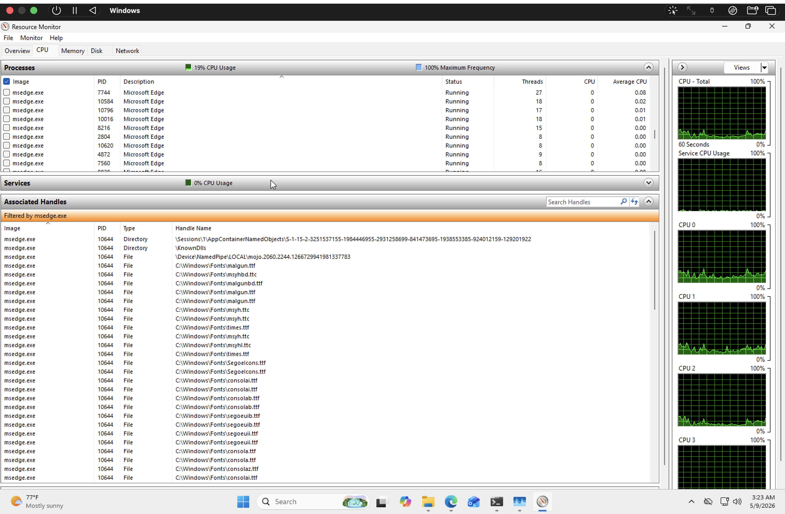

**Figure 5.2:** Resource Monitor CPU tab filtered by `msedge.exe`, with Associated Handles visible.

The `msedge.exe` screenshot shows Microsoft Edge processes in the CPU tab and an Associated Handles panel filtered by `msedge.exe`. The visible handles include:

- directories,
- `KnownDlls`,
- named pipes,
- font files.

This means the browser process is holding many OS-managed resources. Many handles with low CPU usage can indicate that a process is holding resources but is not actively computing at that instant. For browsers, this is normal because browser processes keep files, fonts, IPC channels, caches, and other resources open while waiting for user actions, network events, rendering work, or background tasks.

### 5.3 Performance Monitor Observation

Performance Monitor was configured with the required counters:

- `System\Threads`
- `System\Context Switches/sec`
- `Thread\% Processor Time`
- `Thread\Wait Reason`
- `Thread\Thread State`

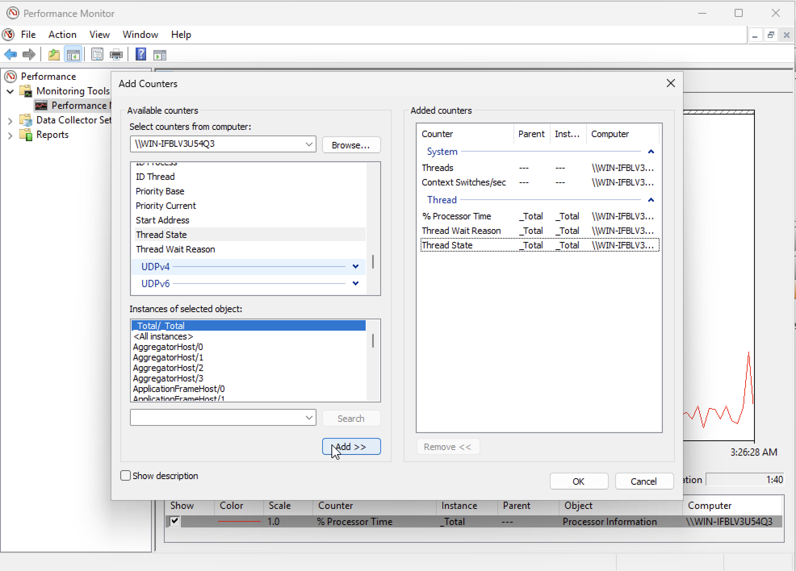

**Figure 5.3:** Performance Monitor Add Counters window showing the selected System and Thread counters.

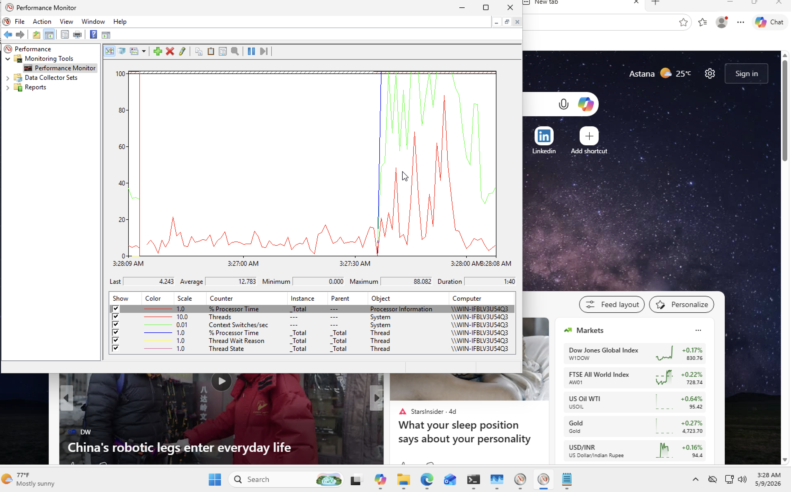

**Figure 5.4:** Performance Monitor graph displaying the selected counters and graph lines.

Counter meanings:

| Counter | Meaning |
|---|---|
| `System\Threads` | Total number of active system threads. |
| `System\Context Switches/sec` | How frequently Windows switches CPU execution between threads. |
| `Thread\% Processor Time` | CPU time used by thread instances. |
| `Thread\Wait Reason` | Reason a thread is waiting. |
| `Thread\Thread State` | Encoded state of a thread. |

Observed Performance Monitor values:

| Counter | Observed value |
|---|---:|
| Timestamp | 5/9/2026 3:29:32 AM |
| `System\Threads` | 2194 |
| `System\Context Switches/sec` | 2922.75804140582 |

At the observed moment, the current number of system threads was 2194. The `Context Switches/sec` value was approximately 2922.76. This means Windows was switching CPU execution between threads about 2923 times per second at that moment.

`Context Switches/sec` increased when applications and browser tabs were opened because the scheduler had more active threads to manage. High context switching can reduce performance because context switching itself is overhead. During a context switch, the CPU spends time saving and restoring thread state instead of only executing useful program instructions.

### 5.4 Thread State Values

| State value | Meaning |
|---:|---|
| 0 | Initialized - the thread object has been created but is not ready to run yet. |
| 1 | Ready - the thread is ready and waiting for CPU scheduling. |
| 2 | Running - the thread is currently executing. |
| 5 | Wait - the thread is waiting for I/O, an event, a lock, a synchronization object, or a timer. |
| 7 | Transition - the thread is ready but waiting for required resources such as kernel stack paging. |

The Wait state is most associated with resource contention because the thread is not running and is waiting for some condition or resource before it can continue.

### 5.5 Python Process Observation

The Python process was observed while `code/deadlock_recovery_observe.py` was running. For OS observation, an extended observation version of the recovery script was used so that the Python process stayed active long enough to capture Task Manager and Resource Monitor screenshots. The logic remained based on timeout-based lock acquisition and retry. This helper was used only for Task 5 observation; it is not a replacement for the required `code/deadlock_recovery.py` implementation.

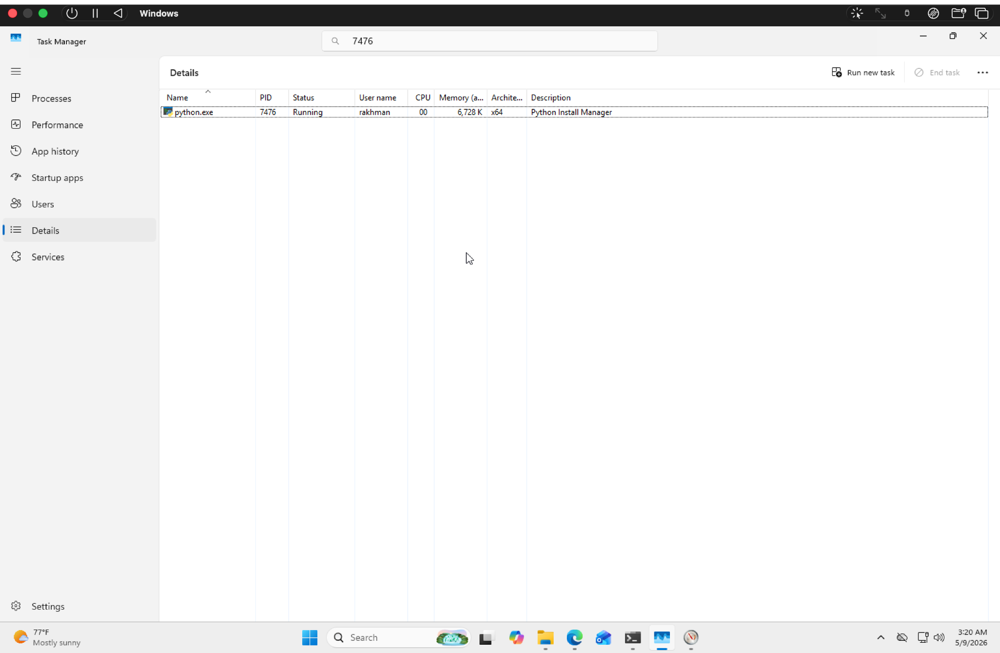

**Figure 5.5:** Python process shown in Task Manager Details view.

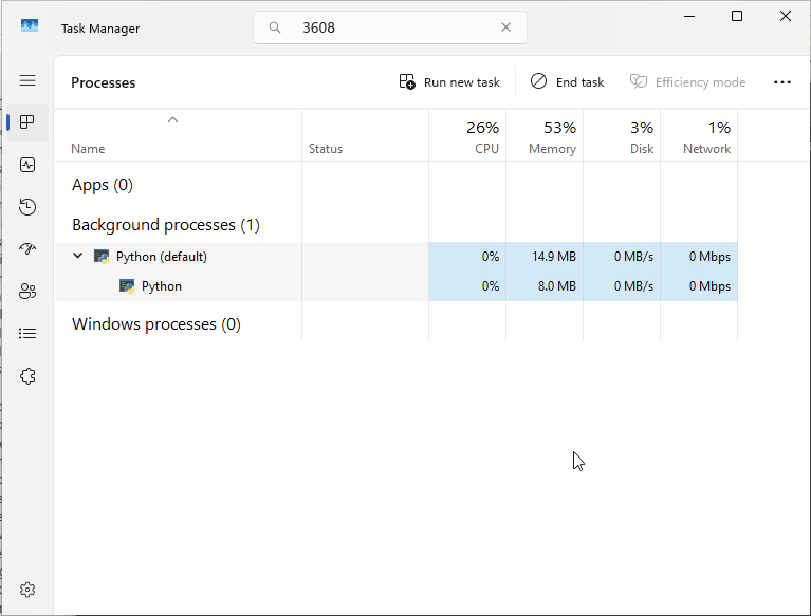

**Figure 5.6:** Python process shown in Task Manager Processes view after searching by PID.

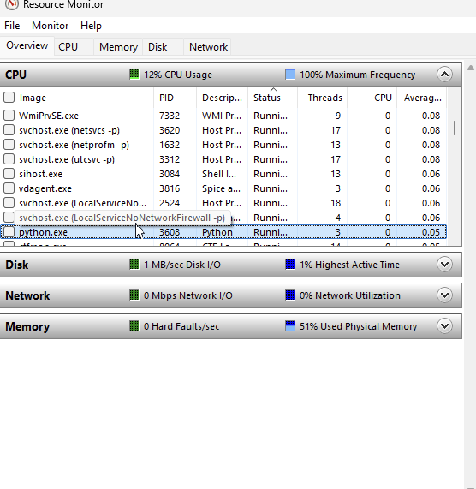

**Figure 5.7:** Resource Monitor overview showing `python.exe` with PID 3608.

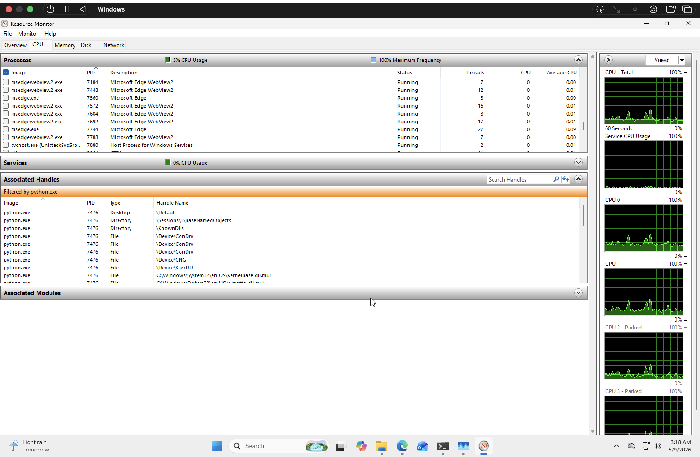

**Figure 5.8:** Resource Monitor CPU tab filtered by `python.exe`, with Associated Handles visible.

The Python process used low CPU because the program is waiting-heavy instead of computation-heavy. Its threads spend much of their time sleeping, waiting for timeouts, retrying lock acquisition, or briefly entering critical sections. Memory usage was stable because the script creates only a small number of locks, threads, and simple data structures. Handles were visible in Resource Monitor because every running process holds OS resources such as files, directories, DLL references, and synchronization-related objects.

This behavior is different from a CPU-intensive program. A CPU-intensive program would continuously execute calculations and show higher CPU usage. The recovery observation script mainly demonstrates synchronization behavior, so low CPU usage is expected.

## 6. Conclusion

This laboratory work demonstrated deadlock theory, detection, avoidance, prevention, and recovery. A deadlock occurs when processes or threads wait forever because each one holds a resource needed by another. The Coffman conditions are important because they explain the exact conditions that must exist for deadlock to happen: mutual exclusion, hold and wait, no preemption, and circular wait.

The Resource Allocation Graph task showed how deadlock can be detected by finding cycles when resources have single instances. The graph examples also showed the difference between a real cycle, a simple waiting situation, and a chain dependency that does not return to its starting point.

The Banker's Algorithm task showed deadlock avoidance. Instead of detecting a deadlock after it occurs, the algorithm checks whether granting a request would keep the system in a safe state. The safe sequence proves that all processes can eventually finish. The unsafe-state example showed why a request may be denied even if it is less than the currently available resources.

The Python thread tasks showed deadlock behavior in real code. The first program created a deadlock by acquiring locks in opposite orders. The second program prevented deadlock by enforcing a global lock order and removing circular wait. The third program demonstrated timeout-based recovery by releasing locks and retrying when progress could not be made.

The Windows observation task connected the theory to real operating system tools. Task Manager showed process and thread activity. Resource Monitor showed handles as OS-managed resources. Performance Monitor showed system thread count, context switches, thread states, and wait-related counters. These tools help observe how real operating systems schedule threads, manage resources, and show waiting behavior.
